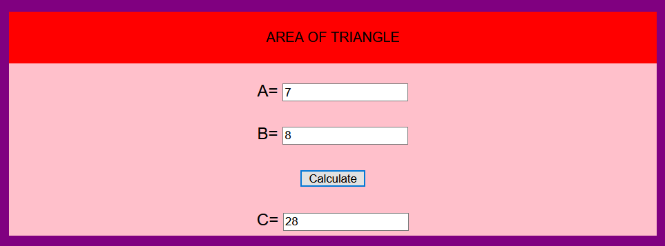

# Mathematical Calculations using JavaScript
## AIM:
To design a website to calculate the area of a triangle and volume of a cylinder using JavaScript.

## DESIGN STEPS:
### Step 1: 
Requirement collection.
### Step 2:
Creating the layout using HTML and CSS.
### Step 3:
Write JavaScript to perform calculations.
### Step 4:
Choose the appropriate style and color scheme.
### Step 5:
Validate the layout in various browsers.
### Step 6:
Validate the HTML code.
### Step 6:
Publish the website in the given URL.

## PROGRAM:

## cylindervolume.html
~~~

<!DOCTYPE html>
<html>

<head>
    <title>VOLUME OF THE CYLINDER</title>
    <link rel="stylesheet" href="">
</head>

<body>
    

        

            

                <b>VOLUME OF THE CYLINDER</b>
            

            

                <form action="" method="GET">
                    
                    

                        <label for="value_a">Radius :</label>
                        <input type="text" name="value_a" id="value_a">
                    

                    

                        <label for="value_b">Height :</label>
                        <input type="text" name="value_b" id="value_b">
                    
                    
                    

                        <button type="button" name="result_button" id="result_button">Calculate Volume</button>
                    

                    

                        <label for="value_c">Result :</label>
                        <input type="text" name="value_c" id="value_c" readonly>
                    

                </form>
            

        

    

    
</body>

</html>
~~~
## trianglearea.html
~~~

<!DOCTYPE html>
<html>

<head>
    <title>AREA OF TRIANGLE</title>
    <link rel="stylesheet" href="">
</head>

<body>
    

        

            

                AREA OF TRIANGLE
            

            

                <form action="" method="GET">
                    
                    

                        <label for="value_a">A=</label>
                        <input type="text" name="value_a" id="value_a">
                    

                    

                        <label for="value_b">B=</label>
                        <input type="text" name="value_b" id="value_b">
                    
                    
                    

                        <button type="button" name="result_button" id="result_button">Calculate</button>
                    

                    

                        <label for="value_c">C=</label>
                        <input type="text" name="value_c" id="value_c" readonly>
                    
                   
                </form>
            

        

    

    
</body>

</html>
~~~
## cylinder.js
~~~
result_button = document.querySelector('#result_button');

result_button.addEventListener('click', function(e){
    txta = document.querySelector('#value_a');
    txtb = document.querySelector('#value_b');
    txtc = document.querySelector('#value_c');
    
    let c;

    c = 22/7 * parseFloat(txta.value**2) * parseFloat(txtb.value);

    txtc.value = c;

});
~~~
## triangle.js
~~~
result_button = document.querySelector('#result_button');

result_button.addEventListener('click', function(e){
    txta = document.querySelector('#value_a');
    txtb = document.querySelector('#value_b');
    txtc = document.querySelector('#value_c');
    
    let c;

    c = (parseFloat(txtb.value) * parseFloat(txta.value)) / 2;

    txtc.value = c;

});
~~~
## volume.css
~~~
*{
      box-sizing: border-box;
      font-family: Arial, Helvetica, sans-serif;
      color: black;
}
body, html{
    margin-top: 0px;
    margin-right: 0px;
    margin-bottom: 0px;
    margin-left: 0px;
    padding-top: 0px;
    padding-right: 0px;
    padding-bottom: 0px;
    padding-left: 0px;
    background-color: purple;
}
.container{
    width: 750px;
    margin-left: auto;
    margin-right: auto;
}
.formview{
    justify-content: center;
    margin-top: 100px; 
}
.forminput{
    height: 50px;
    padding-top: 20px;
    font-size: larger;
}
.banner{
    display: block;
    width: 100%;
    background-color: red;
    padding-top: 20px;
    text-align: center;
    height: 60px;
}
.content{
    display: block;
    width: 100%;
    background-color: pink;
    text-align: center;
}
input{
    color: black;
}
button{
    color: black;
}
~~~

## OUTPUT:

## RESULT:
Thus a website is designed for the area of triangle and volume of cylinder using javascript and is hosted in the URL 
http://aakaash.student.saveetha.in:8000/cylindervolume/
http://aakaash.student.saveetha.in:8000/trianglearea/